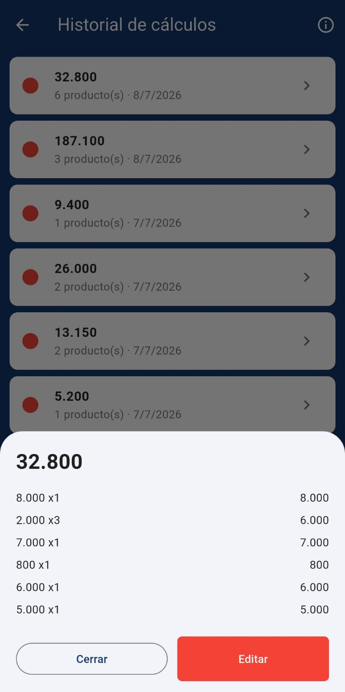
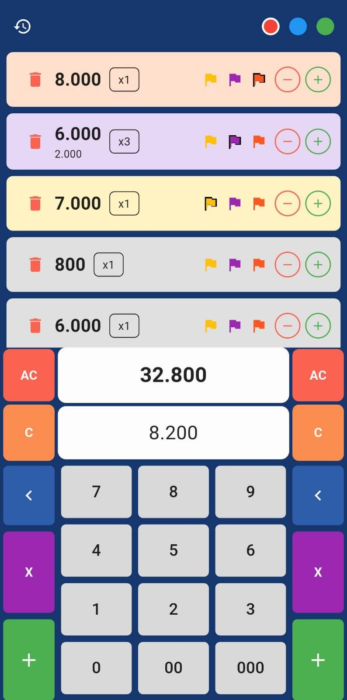

# 🧮 calculadora-tienda-cop

Calculadora de ventas para tiendas colombianas desarrollada en Flutter. Maneja múltiples perfiles de cálculo simultáneos, historial versionado, multiplicación rápida y cálculo de vuelto. 100% local, sin backend.

> Desarrollado por [Diego Alexander Pinzón Camargo](https://github.com/dpinzon-dev?tab=repositories)

---

## ✨ Funcionalidades

- **3 perfiles simultáneos** (rojo, azul, verde) — cambia entre cálculos sin perder información
- **Historial versionado** — cada cálculo se guarda con un ID único; editarlo genera un nuevo registro sin tocar el original
- **Expiración automática** — el historial elimina cálculos con más de 7 días automáticamente
- **Multiplicación directa** — escribe `6.000 × 3` antes de agregar el producto
- **Resaltado de productos** — 3 banderas de color por tarjeta para marcar productos importantes
- **Calculadora de Cambio** — toca el total para calcular cuánto devolver sin afectar el cálculo
- **Formato COP automático** — puntos de miles en tiempo real (locale `es_CO`)
- **Persistencia local** — los 3 perfiles se restauran exactamente como los dejaste al cerrar la app

---

## 📱 Capturas de pantalla

| Calculadora                                  | Historial                                | Cambio                                 |
|----------------------------------------------|------------------------------------------|----------------------------------------|
|  |  |  |
---

## 🏗️ Arquitectura

El proyecto sigue una arquitectura limpia simplificada Clean Architecture adaptada al tamaño del proyecto, con separación clara entre capas de datos, dominio y presentación.

```
lib/
 ├── core/
 │   ├── utils/          # Formateo de moneda COP
 │   └── theme/
 ├── data/
 │   ├── models/         # Producto, Calculo, PerfilColor, ColorResaltado
 │   └── repositories/   # HistorialRepository, EstadoCalculadoraRepository
 ├── features/
 │   ├── calculadora/
 │   │   ├── providers/  # CalculatorNotifier (family), PerfilActivoNotifier
 │   │   └── widgets/    # ProductoCard, TecladoNumerico, DevolucionSheet
 │   ├── historial/
 │   └── credits/
 └── main.dart
```

### Stack técnico

| Capa | Tecnología |
|---|---|
| UI | Flutter (Material 3) |
| Estado | Riverpod 2.x (`FamilyNotifier`) |
| Persistencia | Hive + hive_flutter |
| Generación de código | build_runner + hive_generator |
| Formato de moneda | intl (`NumberFormat`, locale `es_CO`) |
| IDs únicos | uuid |
| Links externos | url_launcher |

---

## 🚀 Instalación

### Requisitos

- Flutter SDK (canal `stable`, versión 3.x o superior)
- Android Studio con Android SDK configurado
- Dispositivo o emulador Android (mínimo API 21 / Android 5.0)

### Pasos

```bash
# 1. Clona el repositorio
git clone https://github.com/dpinzon-dev/calculadora-tienda-cop.git
cd calculadora-tienda-cop

# 2. Instala las dependencias
flutter pub get

# 3. Genera los adapters de Hive
dart run build_runner build --delete-conflicting-outputs

# 4. Corre la app
flutter run
```

---

## 🧪 Tests

El proyecto incluye tests unitarios para la lógica de negocio principal:

```bash
# Correr todos los tests
flutter test

# Test específico del notifier de la calculadora
flutter test test/calculator_notifier_test.dart

# Test del repositorio de historial
flutter test test/historial_repository_test.dart

# Test de persistencia Hive
flutter test test/historial_hive_test.dart
```

---

## 📦 Dependencias principales

```yaml
dependencies:
  flutter_riverpod: ^2.6.1
  hive: ^2.2.3
  hive_flutter: ^1.1.0
  uuid: ^4.5.3
  intl: ^0.20.2
  url_launcher: ^6.x.x

dev_dependencies:
  hive_generator: ^2.0.1
  build_runner: ^2.4.13
  hive_test: ^1.0.2
```

---

## 🤝 Contribuciones

Este proyecto no está abierto a contribuciones externas por el momento.
Si encontraste un bug o tienes una sugerencia, puedes abrir un issue y lo revisaré cuando sea posible.

---

## 📄 Licencia

Este proyecto está bajo la licencia **MIT**.

Esto significa que puedes usar, copiar, modificar y distribuir este código libremente,
incluso en proyectos comerciales, siempre que mantengas el crédito al autor original.

Consulta el archivo [LICENSE](LICENSE) para el texto completo.
---

## 👤 Autor

**Diego Alexander Pinzón Camargo**
- GitHub: [@dpinzon-dev](https://github.com/dpinzon-dev?tab=repositories)
